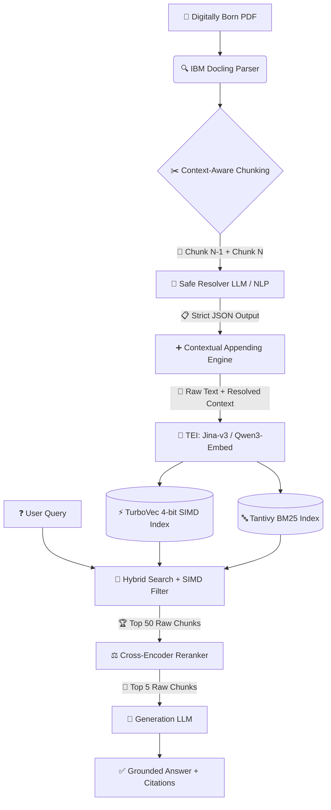

# ReferentWeave

**Reference-Aware RAG Architecture for Structurally Grounded Enterprise Retrieval**

[](https://www.python.org/downloads/)
[](https://www.rust-lang.org/)
[](https://opensource.org/licenses/MIT)

> **ReferentWeave** is a reference-aware RAG architecture that preserves document meaning by resolving ambiguous references and contextual relationships before retrieval, while keeping the original source text untouched.

---

## 🚨 1. The Problem: Why Standard RAG Fails

Standard RAG (Retrieval-Augmented Generation) systems break when reading long, structured business documents like annual reports, legal contracts, or financial filings. 

*   **The Chunking Trap ✂️:** To process long files, standard systems cut the text into random chunks. This destroys connections. If Chunk A says *"Project X was delayed"* and Chunk B says *"It will miss the Q3 deadline"*, the system forgets what *"It"* means.
*   **The Search Failure 🔍:** When you ask, *"Why did Project X miss the deadline?"*, the search misses Chunk B because the words "Project X" aren't in it. 
*   **Metadata Isn't Enough 🏷️:** Just slapping a tag like `[Section: Operations]` on Chunk B doesn't fix the missing link. The AI still doesn't know what *"It"* refers to.

## 💡 2. The Solution: ReferentWeave's "Safe Resolver"

ReferentWeave fixes this by understanding references *before* searching, without changing the original document.

1.  **Find the Missing Links 🕵️‍♂️:** A fast AI looks at a chunk and the chunk right before it to figure out what vague words (like *"they"* or *"the above table"*) actually mean.
2.  **Add Notes, Don't Rewrite 📝:** Instead of using "find-and-replace" (which can accidentally create fake facts or break grammar), we just attach a hidden "cheat sheet" to the end of the text.
3.  **Smart Searching 🧠:** The search engine reads the original text *plus* the cheat sheet, so it perfectly understands the connections.
4.  **Keep the Original Safe 🛡️:** When it's time to write the final answer, the AI *only* reads the original, untouched text. If the cheat sheet was unsure, it simply says "I don't know" instead of making things up.

---

## 🗺️ 3. System Architecture



### ⚙️ How the Pipeline Works (Step-by-Step)

*   **Step 1: Smart Reading 📖** 
    **IBM Docling** reads the PDF, perfectly understanding tables, headers, and reading order without getting confused by complex layouts.
*   **Step 2: Context-Aware Cutting ✂️** 
    We cut the text by logical sections. To solve references, we always give the AI the *current* section plus the *previous* section as background memory.
*   **Step 3: The Safe Resolver 🕵️‍♀️** 
    A small, fast AI (like Qwen 7B) finds vague words and outputs a strict JSON list of what they mean. If it's not 100% sure, it marks it as `UNCERTAIN` so we never guess.
*   **Step 4: The Cheat Sheet (Appending) ➕** 
    We attach the confirmed meanings to the bottom of the chunk. The original text is never altered or overwritten.
*   **Step 5: Dual Indexing 🗄️** 
    We turn the text into math vectors using **TurboVec** (which compresses data by 16x and searches at lightning speed using CPU SIMD instructions) and **Tantivy** (for exact keyword matching).
*   **Step 6: Hybrid Search & Reranking 🎯** 
    When a user asks a question, we search both the math vectors and the keywords. We grab the top 50 results, then use a **Cross-Encoder** AI to double-check and rank the absolute best 5 matches.
*   **Step 7: Grounded Answer ✅** 
    The final AI reads *only* the original raw text of those top 5 chunks and writes the answer, complete with exact citations back to the source document.

---

## 🛠️ 4. Technology Stack (Mid-2026)

| Component | Technology | Purpose |
| :--- | :--- | :--- |
| **Orchestration** | Raw Python, `asyncio`, `Pydantic`, `FastAPI` | Direct tensor/memory control. Zero framework bloat. |
| **Parsing** | **IBM Docling** | Layout analysis, table structure recognition, reading-order preservation. |
| **Resolver LLM** | **Qwen2.5-7B-Instruct** / **Llama-3-8B** (via vLLM) | Fast, cheap, strict JSON schema adherence for coreference resolution. |
| **Embedding** | **Jina-Embeddings-v3** / **Qwen3-Embedding-8B** (via TEI) | Long-context dense representations with native batching. |
| **Dense Index** | **TurboVec** (`IdMapIndex`, 4-bit TurboQuant) | SIMD-accelerated, data-oblivious quantization with native `allowlist` filtering. |
| **Sparse Index** | **Tantivy** (Rust) | High-performance BM25 keyword search for exact entity/acronym matching. |
| **Reranker** | **BGE-Reranker-v2-m3** / **Jina-Reranker-v2** | Single-vector Cross-Encoders for precise entity disambiguation. |
| **Generation** | **Qwen2.5-72B** / **Claude 3.5 Sonnet** | Final answer synthesis using strictly raw, unmodified text. |

---

## ⚡ 5. The TurboVec Integration

ReferentWeave uses **TurboVec** as its primary dense vector engine to solve the memory, latency, and selective-filtering bottlenecks inherent in enterprise RAG. A 10 million document corpus takes 31 GB of RAM as float32. TurboVec fits it in **4 GB** — and searches it faster than FAISS.

### Why TurboVec?
* **4-bit TurboQuant Compression:** Built on Google Research's **TurboQuant** algorithm (ICLR 2026) — a data-oblivious quantizer that matches the Shannon lower bound on distortion, with no codebook training and no separate train phase.
* **Online Ingest:** Add vectors, they're indexed — no train step, no parameter tuning, no rebuilds as the corpus grows.
* **Faster than FAISS:** Hand-written NEON (ARM) and AVX-512BW (x86) kernels beat FAISS `IndexPQFastScan` by 12–20% on ARM and match-or-beat it on x86.
* **Filter at Search Time (SIMD Allowlist):** Pass an id `allowlist` to `search()` and the kernel honours it directly at the 32-vector block granularity. Blocks with no allowed slots are short-circuited *before* any LUT lookup or scoring work. You always get up to `k` results from the allowed set — no over-fetching, no recall hit on selective filters.
* **Length-Renormalized Scoring:** Scalar quantization systematically underestimates inner products. TurboVec computes a per-vector correction scalar at encode time and applies it during search, turning the estimator from downward-biased to unbiased at zero query-time cost.
* **Pure Local & Air-Gapped:** No managed services. No data leaves your VPC. Pairs natively with open-weight models for fully compliant enterprise deployments.

### Core API Usage in ReferentWeave
```python
import numpy as np
from turbovec import IdMapIndex

# 4-bit TurboQuant, 1536-dim embeddings
index = IdMapIndex(dim=1536, bit_width=4)

# Ingest with stable external IDs (uint64)
index.add_with_ids(vectors, np.array([1001, 1002, 1003], dtype=np.uint64))

# O(1) deletion by external ID
index.remove(1002)

# SIMD-accelerated search with tenant/document filtering
# Stage 1: external system narrows to candidate ids.
allowed_ids = np.array([1001, 1005, 1009], dtype=np.uint64)
# Stage 2: dense rerank within the candidate set.
scores, ids = index.search(query_vector, k=50, allowlist=allowed_ids)

# Persistence
index.write("referent_index.tvim")
loaded_index = IdMapIndex.load("referent_index.tvim")
```

---

## 💻 6. Implementation Pipeline

### Phase 1: Context-Aware Chunking
Chunks are never processed in isolation. The resolver receives the target chunk plus its immediate predecessor to resolve cross-boundary references.

```python
# ingestion/parser.py
def build_context_chunks(raw_chunks: list[dict]) -> list[dict]:
    context_chunks = []
    for i, chunk in enumerate(raw_chunks):
        background = raw_chunks[i-1].text if i > 0 else ""
        context_chunks.append({
            "chunk_id": chunk.id,
            "background_context": background,
            "target_text": chunk.text,
            "metadata": chunk.hierarchy
        })
    return context_chunks
```

### Phase 2: The Safe Resolver
Strict JSON enforcement. Low-confidence guesses are explicitly rejected.

```python
# ingestion/resolver.py
RESOLVER_PROMPT = """
You are a precision coreference resolver. 
Background Context: {background}
Target Text: {target}

Identify vague references, pronouns (it, they, this), and ambiguous nouns in the Target Text.
Resolve them using ONLY the Background Context or Target Text.
If you are not 100% certain, mark the resolution as "UNCERTAIN". Do not guess.

Output strict JSON:
{{
  "resolutions": [
    {{"original_phrase": "it", "resolved_entity": "Project X", "confidence": "high"}},
    {{"original_phrase": "they", "resolved_entity": "UNCERTAIN", "confidence": "low"}}
  ]
}}
"""
```

### Phase 3: Contextual Appending
We append. We never overwrite. Grammar and source integrity remain mathematically intact.

```python
# ingestion/enricher.py
def build_enriched_text(chunk: dict, resolutions: list[dict]) -> str:
    raw_text = chunk["target_text"]
    safe_resolutions = [r for r in resolutions if r["confidence"] == "high" and r["resolved_entity"] != "UNCERTAIN"]
    
    if not safe_resolutions:
        return raw_text
        
    context_block = "\n\n[Resolved Context Block:\n"
    for r in safe_resolutions:
        context_block += f"- '{r['original_phrase']}' = {r['resolved_entity']}\n"
    context_block += "]"
    
    return raw_text + context_block
```

### Phase 4: Hybrid Retrieval & Reranking
1. **Dense:** TurboVec search with SIMD `allowlist` filtering.
2. **Sparse:** Tantivy BM25 search with identical metadata filters.
3. **Fusion:** Reciprocal Rank Fusion (RRF) merges results into a unique Top 50.
4. **Rerank:** Cross-Encoder scores `[Query, Raw Chunk]` pairs. Top 5 selected.
5. **Generate:** Raw chunks injected into LLM prompt. Citations mapped to chunk IDs.

---

## 🛡️ 7. Safeguards & Failure Modes

| Edge Case | Failure Mode | Mitigation Strategy |
| :--- | :--- | :--- |
| **Empty Allowlist** | App passes `[]` to TurboVec. SIMD kernel short-circuits, returning 0 results. | Orchestration explicitly checks for global queries and passes `None` to bypass allowlist logic. |
| **Table Header Bloat** | Repeating wide Markdown headers consumes embedding tokens. | If header > 15% of chunk limit, generate a 2-sentence structural table summary instead of raw headers. |
| **Resolver Hallucination** | LLM guesses wrong entity, poisoning retrieval. | `UNCERTAIN` mandate drops low-confidence resolutions. BM25 + Cross-Encoder catch fallback misses. |
| **"Dirty" Digital PDFs** | Watermarks/embedded objects break Docling reading order. | Pre-flight heuristic: if non-alphanumeric ratio > threshold, route to vision parser or flag for review. |
| **Cross-Encoder Latency** | Reranking 50 long chunks adds 300ms+ to query time. | Truncate chunks to first 512 tokens before reranking. Negligible accuracy loss, massive latency gain. |

---

## 📊 8. Evaluation Strategy

ReferentWeave rejects "vibe-based" evaluation. Metrics are component-isolated and mathematically rigorous:

1. **Coreference Recall:** Synthetic dataset of 500 pronoun-heavy queries. Measures Stage 1 retrieval success rate for chunks containing the actual antecedent.
2. **Context Precision (RAGAS):** Signal-to-noise ratio in the Top 5 chunks passed to the generator.
3. **Table Integrity Score:** Manual verification that multi-page table queries retrieve correct column-row relationships without structural flattening.
4. **Ablation Testing:** Periodic disabling of `[Resolved Context Block]`, BM25, and Cross-Encoder to quantify exact contribution to answer quality. Dead weight is removed.

---

## 🚀 9. Setup & Installation

### Prerequisites
* Python 3.10+
* Rust (Cargo)
* Docker (for TEI & vLLM)
* CPU with AVX2/AVX-512 or ARM NEON support

### Build & Run
```bash
# 1. Clone & Setup
git clone https://github.com/your-org/ReferentWeave.git
cd ReferentWeave
python -m venv venv && source venv/bin/activate
pip install -r requirements.txt

# 2. Build TurboVec Python Bindings
pip install maturin
cd turbovec-python
maturin build --release
pip install target/wheels/*.whl
cd ..

# 3. Start Inference Engines
# TEI for Embeddings
docker run --gpus all -p 8080:80 \
  -v $PWD/models:/models \
  ghcr.io/huggingface/text-embeddings-inference:1.5 \
  --model-id /models/jina-embeddings-v3

# vLLM for Resolver
python -m vllm.entrypoints.openai.api_server \
  --model Qwen/Qwen2.5-7B-Instruct --port 8000

# 4. Run API
uvicorn api.main:app --host 0.0.0.0 --port 8001
```

---

## 📂 10. Project Structure

```text
ReferentWeave/
├── ingestion/
│   ├── parser.py           # Docling integration & structural chunking
│   ├── resolver.py         # NLP + LLM coreference resolution
│   ├── enricher.py         # Contextual appending logic
│   └── embedder.py         # TEI client & TurboVec/Tantivy indexing
├── retrieval/
│   ├── hybrid_search.py    # RRF fusion of TurboVec & Tantivy
│   ├── reranker.py         # Cross-Encoder integration
│   └── generator.py        # Final LLM prompt assembly
├── core/
│   ├── models.py           # Pydantic schemas for Chunks, Resolutions
│   ├── turbovec_client.py  # IdMapIndex wrapper & SIMD allowlist logic
│   └── config.py           # System parameters
├── api/
│   └── main.py             # FastAPI endpoints
├── tests/
│   └── eval_harness.py     # Coreference recall & RAGAS metrics
├── turbovec-python/        # Local maturin build dir for turbovec bindings
├── requirements.txt
├── Cargo.toml
└── README.md
```

---

## 🤝 11. Contributing

ReferentWeave is a highly opinionated, production-focused architecture. We do not accept PRs that introduce:
* LangChain, LlamaIndex, or heavy orchestration abstractions.
* Probabilistic text-rewriting or in-place coreference replacement.
* Unquantified "vibe-based" evaluation metrics.

Valid contributions focus on:
* Optimizing TurboVec SIMD allowlist Python bindings.
* Improving Docling table-to-markdown fallback logic.
* Adding rigorous evaluation datasets for financial/legal coreferences.
* Hardening the `UNCERTAIN` fallback heuristics.

---

## 📜 12. License

This project is licensed under the MIT License. See the `LICENSE` file for details.

---

**ReferentWeave** does not guess. It resolves, retrieves, and grounds. Build with precision.
