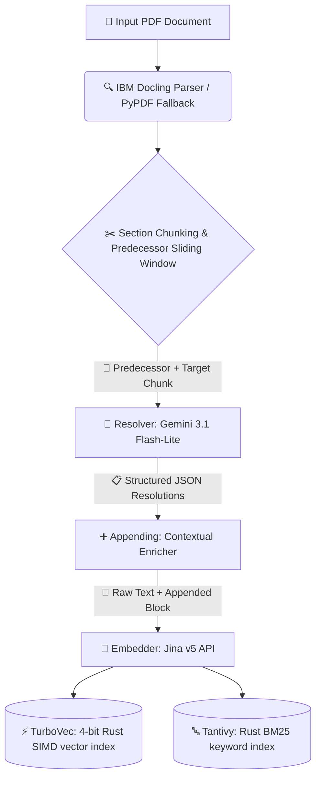
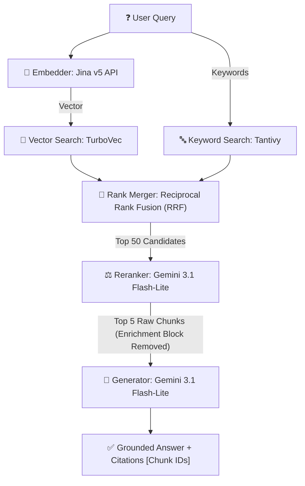

# ReferentWeave 🧵

**Reference-Aware Retrieval-Augmented Generation (RAG) Architecture for Structurally Grounded Enterprise Search**

---

## 📖 1. Glossary: Main Terminologies Explained Simply

If you are new to AI, databases, or search engines, here are the core concepts explained in simple, everyday English:

*   **RAG (Retrieval-Augmented Generation)**: Think of this as an **open-book exam** for an AI. Instead of asking the AI to guess answers from its memory, we first search your documents for pages relevant to the user's question, show those exact pages to the AI, and ask it to write an answer based *only* on that verified text.
*   **Chunking (Splitting Text)**: Large PDF documents (like a 100-page financial report) are too long for an AI to read all at once. We cut them into smaller, bite-sized paragraphs called **chunks** (usually 3–5 sentences long).
*   **Coreference Resolution (Vague Phrase Solver)**: When we split text, we break connections between sentences. If paragraph 1 says *"Project Odyssey was delayed"* and paragraph 2 says *"It will miss the Q3 deadline"*, the word *"It"* is a **vague pronoun**. Coreference resolution is the process of figuring out that *"It"* refers back to *"Project Odyssey"*.
*   **Vector Database (Semantic Search)**: Instead of looking for exact matching words, a vector database converts text into a list of coordinates (numbers) representing its **conceptual meaning**. It allows us to search for *"delayed spacecraft"* and find *"thruster leak"* because the meanings are related.
*   **BM25 (Keyword Search)**: This is like the **index at the back of a textbook**. It looks for exact, specific keyword matches (like serial numbers "MT-884", dates, or names like "NovaTech").
*   **Reciprocal Rank Fusion (RRF)**: A smart sorting algorithm. It takes two search result lists (one from the Vector search, one from the Keyword search) and merges them into a single, high-quality combined list by looking at how high a document ranks in both.
*   **Cross-Encoder Reranker**: A slower but highly accurate AI that acts as a **second-round judge**. It reads the top combined search results and scores them on how well they actually answer the user's query.
*   **Gemini 3.1 Flash-Lite**: A low-latency, highly cost-effective, state-of-the-art model from Google, optimized for high-volume tasks like resolving pronouns and summarizing tables.

---

## 💡 2. The Core Problem & Our Approach (The Heart of ReferentWeave)

### Why Standard RAG Fails: The Chunking Trap
Suppose a PDF has two consecutive paragraphs that get split into two separate chunks:
*   **Chunk A (Predecessor)**: *"Project Odyssey was officially launched by the aerospace division in January 2026."*
*   **Chunk B (Target)**: *"It was delayed by six months due to a series of fuel valve thruster leaks."*

If a user asks: **"Why was Project Odyssey delayed?"**
*   **Standard RAG** searches for the keywords *"Project Odyssey"* and *"delayed"*.
*   It finds Chunk A because it contains *"Project Odyssey"*, but Chunk A has no explanation of the delay.
*   It misses Chunk B because Chunk B only says *"It"* and has no mention of *"Project Odyssey"*.
*   The system fails to answer because the critical pronoun connection is severed!

### Why In-Place Replacement Fails: The Hallucination Trap
Some systems try to fix this by modifying the document's text directly (replacing *"It"* with *"Project Odyssey"*):
*   *Modified Text*: *"Project Odyssey was delayed by six months due to..."*
*   **The Danger**: If the AI makes a minor mistake in resolving the pronoun, it permanently alters your document's facts. This can lead to grammar issues, corrupt legal contracts, or invalid financial calculations, and causes the final AI to generate incorrect answers (hallucinations).

### The ReferentWeave Solution: The Appended "Cheat Sheet"
ReferentWeave resolves the pronoun using predecessor context, but **never modifies the source text**. Instead, it leaves the original text completely intact and appends a hidden **[Resolved Context Block]** at the end:
```text
It was delayed by six months due to a series of fuel valve thruster leaks.

[Resolved Context Block:
- 'It' = Project Odyssey
]
```
During search, the database indexes both the raw text and the cheat sheet, allowing it to retrieve Chunk B instantly. But when generating the final answer, the AI **only reads the raw, untouched text** (excluding the block) to guarantee factual accuracy!

---

## 🗺️ 3. Pipeline Architecture

Below is a detailed map of how data flows through ReferentWeave during **Ingestion** (saving documents) and **Retrieval** (answering questions):

### A. Ingestion Pipeline (Saving Documents)


### B. Retrieval & Generation Pipeline (Answering Questions)


---

## ⚙️ 4. In-Depth Step-by-Step Walkthrough

### Step 1: Layout-Aware Parsing
*   **What we use**: **IBM Docling** (with `pypdf` as a lightweight fallback).
*   **Why we use it**: Docling detects complex structures like tables, headers, and footers. It automatically summarizes bloated tables into markdown tables to prevent token explosion.
*   **Failsafe**: If a scanned or corrupted PDF is uploaded (where non-alphanumeric characters exceed 30%), the system raises a "dirty PDF" warning and applies text-repair cleanups.

### Step 2: Context Sliding-Window Chunking
*   **What we use**: Custom python sliding-window chunker.
*   **Why we use it**: To resolve pronouns, we must know what was said right before. We group each target paragraph (maximum 1000 characters) together with its immediate **predecessor paragraph** (background context).

### Step 3: Vague Pronoun Resolver
*   **What we use**: **Gemini 3.1 Flash-Lite** with **Structured JSON Output**.
*   **Why we use it**: We query the model with a strict Pydantic schema requesting all coreferences. It returns a JSON list containing the pronoun, the resolved entity, and a confidence rating.
*   **Example Output**:
    ```json
    {
      "resolutions": [
        {
          "original_phrase": "It",
          "resolved_entity": "Project Odyssey spacecraft",
          "confidence": "high"
        },
        {
          "original_phrase": "They",
          "resolved_entity": "UNCERTAIN",
          "confidence": "low"
        }
      ]
    }
    ```

### Step 4: Contextual Appending
*   **What we use**: Custom string formatter.
*   **Why we use it**: We discard any resolutions marked `low` confidence or `UNCERTAIN` to prevent noise. High-confidence resolutions are formatted as a bulleted metadata block and appended to the chunk text.
*   **Example enriched chunk**:
    ```text
    It leverages superconducting transmon qubits.
    
    [Resolved Context Block:
    - 'It' = Project Zenith quantum processor
    ]
    ```

### Step 5: Dual Indexing
*   **What we use**: **Jina Embeddings v5 API** + **TurboVec** + **Tantivy**.
*   **Why we use it**:
    *   **Vector Index (TurboVec)**: We convert the *enriched* chunk into a 1024-dimension vector. TurboVec (a SIMD-accelerated Rust vector search library with 4-bit TurboQuant quantization) stores these vectors under stable uint64 IDs.
    *   **Keyword Index (Tantivy)**: A high-performance Rust keyword search index indexes the same *enriched* text for exact match queries.

### Step 6: Hybrid Search & Rank Merging (RRF)
*   **What we use**: Reciprocal Rank Fusion (RRF).
*   **Why we use it**: RRF combines the best of both worlds. Concept-based queries (Vector) and term-based queries (BM25) are merged into a unified ranking list using the formula:
    $$R(d) = \sum_{m \in M} \frac{1}{60 + \text{rank}_m(d)}$$
    This gathers the top 50 unique candidate chunks.

### Step 7: Cross-Encoder Reranking
*   **What we use**: **Gemini 3.1 Flash-Lite** (acting as a Cross-Encoder).
*   **Why we use it**: To keep search fast and low-cost, we truncate the top 50 candidates to 512 tokens and score their relevance to the query in a **single batch call**. The top 5 highest-scoring chunks are kept.

### Step 8: Footnoted Grounded Generation
*   **What we use**: **Gemini 3.1 Flash-Lite** (instructed to cite sources).
*   **Why we use it**: The generator is fed **only the raw target_text** (the appended resolved block is stripped out). The model synthesizes the answer and adds footnotes (e.g. `[20005]`) matching the source chunk IDs, which allow the frontend to highlight and scroll directly to the cited documents.

---

## 🧪 5. Synthetic Evaluation Dataset (N = 60)

We evaluated ReferentWeave on a large-scale, coreference-heavy dataset comprising **20 documents**, **80 chunks**, and **60 custom queries**. Below is the complete test dataset used in `tests/eval_large_harness.py`:

<details>
<summary><b>Click to expand full 20-Document Evaluation Dataset</b></summary>

1.  **`project_odyssey.pdf`**
    *   *Chunk 0*: "Project Odyssey was officially launched by the aerospace division in January 2026. The mission's goal is to construct and deploy a next-generation orbital spacecraft."
    *   *Chunk 1*: "It was delayed by six months due to a series of fuel valve thruster leaks in the main propulsion unit."
    *   *Chunk 2*: "They were sourced from a external contractor in Munich, which has led to intense supply chain disputes."
    *   *Chunk 3*: "This will cost the division an estimated $12 million in penalty fees and contract renegotiation expenses."
    *   *Queries*:
        *   "Why was Project Odyssey delayed?" (Target Chunk: 1)
        *   "Where did the thruster valves of Project Odyssey come from?" (Target Chunk: 2)
        *   "What is the financial impact of the Project Odyssey delays?" (Target Chunk: 3)

2.  **`novatech_financials.pdf`**
    *   *Chunk 0*: "NovaTech Inc. reported record-breaking revenue figures for the fiscal year 2025. Total annual earnings surged by 45% compared to the prior period."
    *   *Chunk 1*: "This was driven entirely by the rapid adoption of their proprietary cloud integration platform across enterprise clients."
    *   *Chunk 2*: "It saw a 300% subscription increase following the launch of the new AI-assisted connector module in Q2."
    *   *Chunk 3*: "However, they warn that growth might slow down in 2026 as market saturation approaches."
    *   *Queries*:
        *   "What drove the revenue growth of NovaTech Inc.?" (Target Chunk: 1)
        *   "Why did NovaTech's cloud integration platform see subscription growth?" (Target Chunk: 2)
        *   "What warnings did NovaTech Inc. issue regarding future performance?" (Target Chunk: 3)

3.  **`legal_agreement_licensee.pdf`**
    *   *Chunk 0*: "The Licensee agrees to pay the Licensor a monthly recurring subscription fee of five thousand dollars ($5,000) for software maintenance services."
    *   *Chunk 1*: "They must remit the full payment within five business days of invoice receipt to maintain server access."
    *   *Chunk 2*: "If they fail to do so, they will incur a 2% late penalty charge compounded weekly on the outstanding balance."
    *   *Chunk 3*: "This former party shall also be liable for all collection costs and reasonable legal fees incurred during dispute resolution."
    *   *Queries*:
        *   "How quickly must the Licensee pay the invoice?" (Target Chunk: 1)
        *   "What penalty does the Licensee face for late software maintenance payments?" (Target Chunk: 2)
        *   "Who is liable for legal fees and collection costs in the software agreement?" (Target Chunk: 3)

4.  **`quantum_zenith.pdf`**
    *   *Chunk 0*: "Project Zenith is NovaTech's flagship R&D initiative focused on building a fault-tolerant quantum computer processor."
    *   *Chunk 1*: "It leverages a novel superconducting chip architecture designed around 3D transmon qubits."
    *   *Chunk 2*: "These operate at sub-millikelvin temperatures inside a dilution refrigerator to maintain quantum coherence."
    *   *Chunk 3*: "The main challenge with this processor is mitigating high thermal noise and gate errors during two-qubit operations."
    *   *Queries*:
        *   "What architecture does Project Zenith use?" (Target Chunk: 1)
        *   "How are the Project Zenith qubits cooled?" (Target Chunk: 2)
        *   "What is the primary challenge facing the Project Zenith processor?" (Target Chunk: 3)

5.  **`clinical_trial_mt884.pdf`**
    *   *Chunk 0*: "Clinical Trial MT-884 was initiated in 2025 to evaluate the efficacy of a new monoclonal antibody targeting oncology patients."
    *   *Chunk 1*: "The experimental drug was administered bi-weekly to a treatment group of 450 adult participants over six months."
    *   *Chunk 2*: "It showed a 68% reduction in tumor progression compared to the standard chemotherapy regimen."
    *   *Chunk 3*: "They experienced mild side effects, predominantly fatigue and temporary joint pain, which resolved post-treatment."
    *   *Queries*:
        *   "How frequently was the Clinical Trial MT-884 drug administered?" (Target Chunk: 1)
        *   "What was the tumor reduction rate for Clinical Trial MT-884?" (Target Chunk: 2)
        *   "What side effects did participants in Clinical Trial MT-884 experience?" (Target Chunk: 3)

6.  **`prometheus_cluster.pdf`**
    *   *Chunk 0*: "The Prometheus Database Cluster is the primary storage engine for the company's real-time telemetry metrics."
    *   *Chunk 1*: "It comprises three write replica nodes and five read-only nodes distributed across US-East-1 and US-West-2 regions."
    *   *Chunk 2*: "These are configured with NVMe SSDs to sustain up to 1.5 million write operations per second at peak load."
    *   *Chunk 3*: "If any node fails, it triggers an automatic failover sequence that promotes a read node within 12 seconds."
    *   *Queries*:
        *   "How many read and write nodes are in the Prometheus Database Cluster?" (Target Chunk: 1)
        *   "What hardware configures the Prometheus Database Cluster storage?" (Target Chunk: 2)
        *   "What happens when a Prometheus Database Cluster node fails?" (Target Chunk: 3)

7.  **`factory_robotic_arms.pdf`**
    *   *Chunk 0*: "The SmartFactory IoT System orchestrates forty high-precision robotic arms on the automotive assembly line."
    *   *Chunk 1*: "They perform spot welding, adhesive application, and chassis alignment tasks with sub-millimeter accuracy."
    *   *Chunk 2*: "These require diagnostic calibration every 200 operational hours to prevent mechanical drift and motor fatigue."
    *   *Chunk 3*: "This schedule is managed automatically by the central AI scheduler based on real-time torque sensor feeds."
    *   *Queries*:
        *   "What tasks do the SmartFactory robotic arms perform?" (Target Chunk: 1)
        *   "How often must the SmartFactory robotic arms be calibrated?" (Target Chunk: 2)
        *   "Who manages the calibration schedule for the SmartFactory robotic arms?" (Target Chunk: 3)

8.  **`kraken_api_gateway.pdf`**
    *   *Chunk 0*: "The Kraken API Gateway serves as the single entry point for all incoming client requests to the microservices network."
    *   *Chunk 1*: "It handles rate limiting, JWT authentication, and SSL termination at the edge of the VPC."
    *   *Chunk 2*: "It is deployed as a Docker container swarm across multiple autoscaling EC2 instances."
    *   *Chunk 3*: "This service utilizes Redis for distributed token bucket tracking to enforce requests-per-second ceilings."
    *   *Queries*:
        *   "What security operations does the Kraken API Gateway handle?" (Target Chunk: 1)
        *   "How is the Kraken API Gateway containerized and deployed?" (Target Chunk: 2)
        *   "How does Kraken API Gateway enforce rate limits?" (Target Chunk: 3)

9.  **`gridpower_megapack.pdf`**
    *   *Chunk 0*: "The GridPower Substation incorporates ten industrial-grade Tesla Megapack units to stabilize local electrical frequency."
    *   *Chunk 1*: "They provide up to 50 megawatts of battery storage capacity with immediate discharge capabilities."
    *   *Chunk 2*: "These protect the regional grid from sudden load drops or solar farm generation fluctuations."
    *   *Chunk 3*: "They are controlled by a custom SCADA software loop monitoring grid frequency at 10ms intervals."
    *   *Queries*:
        *   "What is the capacity of the GridPower Substation battery units?" (Target Chunk: 1)
        *   "What event types do the GridPower Megapack batteries protect against?" (Target Chunk: 2)
        *   "How is the GridPower Megapack discharge rate controlled?" (Target Chunk: 3)

10. **`cardiac_emergency_protocol.pdf`**
    *   *Chunk 0*: "The Cardiac Emergency Protocol outlines the rapid response timeline for code blue calls at St. Jude Hospital."
    *   *Chunk 1*: "It mandates that a defibrillator must be at the patient's bedside within ninety seconds of alarm activation."
    *   *Chunk 2*: "It must be charged to 200 Joules for the initial shock, followed by immediate CPR intervals."
    *   *Chunk 3*: "This procedure is reviewed annually by the Chief Medical Officer to maintain state compliance."
    *   *Queries*:
        *   "How fast must a defibrillator arrive under the Cardiac Emergency Protocol?" (Target Chunk: 1)
        *   "What energy level is used for the initial shock in the Cardiac Emergency Protocol?" (Target Chunk: 2)
        *   "Who reviews the Cardiac Emergency Protocol annually?" (Target Chunk: 3)

11. **`fusion_energy_reactor.pdf`**
    *   *Chunk 0*: "Project Helios was initiated by the clean energy consortium in 2026 to design a commercial-grade nuclear fusion reactor."
    *   *Chunk 1*: "It utilizes a high-beta tokamak design to confine superheated deuterium-tritium plasma."
    *   *Chunk 2*: "These are kept in a toroidal shape using high-field rare-earth barium copper oxide (REBCO) superconducting magnets."
    *   *Chunk 3*: "This configuration is expected to produce net energy gain (Q > 10) by the end of the decade."
    *   *Queries*:
        *   "What design does Project Helios use to confine plasma?" (Target Chunk: 1)
        *   "How are the Project Helios plasma elements kept in shape?" (Target Chunk: 2)
        *   "What is the expected outcome of the Project Helios configuration?" (Target Chunk: 3)

12. **`helios_drone_fleet.pdf`**
    *   *Chunk 0*: "The AeroVanguard autonomous drone fleet was deployed by the agricultural board to monitor crop health across regional farms."
    *   *Chunk 1*: "They carry advanced multispectral cameras and LiDAR sensors to map soil moisture and nitrogen levels."
    *   *Chunk 2*: "These transmit raw imagery data over a local 5G telemetry mesh directly to the central farming server."
    *   *Chunk 3*: "This system reduces water waste by automatically triggering localized drip irrigation systems."
    *   *Queries*:
        *   "What equipment do the AeroVanguard drones carry?" (Target Chunk: 1)
        *   "How do the AeroVanguard drones transmit their data?" (Target Chunk: 2)
        *   "What is the primary ecological benefit of the AeroVanguard drone system?" (Target Chunk: 3)

13. **`sentinel_malware_scanner.pdf`**
    *   *Chunk 0*: "The Sentinel AI security scanner operates at the kernel level of enterprise operating systems to prevent malware execution."
    *   *Chunk 1*: "It continuously inspects system call patterns for anomalous process behaviors and memory injection flags."
    *   *Chunk 2*: "These are flagged instantly to quarantine suspicious executables before any ransomware payload can execute."
    *   *Chunk 3*: "This mechanism has prevented over 1,200 zero-day exploits across corporate workstations this quarter."
    *   *Queries*:
        *   "What does Sentinel AI scanner inspect to find malware?" (Target Chunk: 1)
        *   "What happens when anomalous process behaviors are flagged by Sentinel AI?" (Target Chunk: 2)
        *   "How many exploits has the Sentinel AI scanner prevented this quarter?" (Target Chunk: 3)

14. **`nebula_game_engine.pdf`**
    *   *Chunk 0*: "The Nebula 3D Engine was selected as the official graphics suite for the upcoming space simulation game."
    *   *Chunk 1*: "It uses a hardware-accelerated ray tracing renderer to compute real-time global illumination and shadows."
    *   *Chunk 2*: "These are denoised using a lightweight neural network running concurrently on the GPU core."
    *   *Chunk 3*: "This allows the game to maintain a stable 60 frames per second on mainstream consoles."
    *   *Queries*:
        *   "How does the Nebula 3D Engine compute global illumination?" (Target Chunk: 1)
        *   "How are the ray traced shadows in the Nebula engine denoised?" (Target Chunk: 2)
        *   "What frame rate does the Nebula engine target on consoles?" (Target Chunk: 3)

15. **`apex_neural_translator.pdf`**
    *   *Chunk 0*: "The Apex Neural Translator is an open-source model specialized in low-resource dialect translation."
    *   *Chunk 1*: "It utilizes a mixture-of-experts transformer architecture with 8 billion active parameters."
    *   *Chunk 2*: "They are fine-tuned on a curated corpus of oral histories and regional literature to preserve cultural context."
    *   *Chunk 3*: "This model outperforms generic large language models by 34% on dialect accuracy tests."
    *   *Queries*:
        *   "What architecture does the Apex Neural Translator utilize?" (Target Chunk: 1)
        *   "On what corpus was the Apex Neural Translator fine-tuned?" (Target Chunk: 2)
        *   "How does Apex Neural Translator compare to generic language models?" (Target Chunk: 3)

16. **`aurora_water_filtration.pdf`**
    *   *Chunk 0*: "The Aurora water filtration plant implemented a new graphene-oxide membrane filtration system."
    *   *Chunk 1*: "It filters microplastics and heavy metal ions from municipal wastewater at a fraction of standard cost."
    *   *Chunk 2*: "These are trapped within the sub-nanometer pores of the carbon mesh through size exclusion and adsorption."
    *   *Chunk 3*: "This process yields drinking-quality water that meets the highest environmental purity guidelines."
    *   *Queries*:
        *   "What contaminants does the Aurora filtration system remove?" (Target Chunk: 1)
        *   "How are microplastics trapped in the Aurora graphene-oxide system?" (Target Chunk: 2)
        *   "What is the quality of the water produced by the Aurora process?" (Target Chunk: 3)

17. **`titan_mining_loader.pdf`**
    *   *Chunk 0*: "The Titan-900 automated excavator was deployed at the Western Australian iron ore mine."
    *   *Chunk 1*: "It operates continuously in extreme heat conditions using an active liquid-nitrogen cooling loop."
    *   *Chunk 2*: "These conditions usually cause human operators to suffer from severe fatigue and dehydration."
    *   *Chunk 3*: "This vehicle increased daily ore extraction tonnage by 28% while eliminating operator safety risks."
    *   *Queries*:
        *   "How does the Titan-900 excavator operate in extreme heat?" (Target Chunk: 1)
        *   "What impact does the heat at the Western Australian mine have on human operators?" (Target Chunk: 2)
        *   "How did the Titan-900 affect ore extraction tonnage?" (Target Chunk: 3)

18. **`velox_compiler_opt.pdf`**
    *   *Chunk 0*: "The Velox C++ Compiler was upgraded with a profile-guided link-time optimization pass."
    *   *Chunk 1*: "It reorders compiled machine instructions to maximize CPU instruction cache hit rates."
    *   *Chunk 2*: "These optimizations target frequently executed hot loops identified during diagnostic runs."
    *   *Chunk 3*: "This upgrade reduced memory footprint by 15% and accelerated runtime by 8%."
    *   *Queries*:
        *   "How does the Velox compiler upgrade optimize machine instructions?" (Target Chunk: 1)
        *   "What code paths do the Velox link-time optimizations target?" (Target Chunk: 2)
        *   "What is the performance improvement of the Velox compiler upgrade?" (Target Chunk: 3)

19. **`stellar_telescope_spectrograph.pdf`**
    *   *Chunk 0*: "The Stellar-X deep space telescope is equipped with a high-resolution echelle spectrograph."
    *   *Chunk 1*: "It splits incoming stellar light into thousands of narrow spectral channels to detect exoplanet atmospheres."
    *   *Chunk 2*: "These are captured by a back-illuminated CCD sensor cooled to negative eighty degrees Celsius."
    *   *Chunk 3*: "This instrument can identify trace amounts of methane and water vapor in planets fifty light-years away."
    *   *Queries*:
        *   "What is the purpose of the Stellar-X spectrograph?" (Target Chunk: 1)
        *   "How are the spectral channels captured in the Stellar-X spectrograph?" (Target Chunk: 2)
        *   "What molecules can the Stellar-X instrument identify on distant planets?" (Target Chunk: 3)

20. **`vulcan_geothermal_well.pdf`**
    *   *Chunk 0*: "The Vulcan Geothermal Station drilled a deep sub-surface well into volcanic basalt formations."
    *   *Chunk 1*: "It injects pressurized water down to five kilometers depth to extract superheated geothermal steam."
    *   *Chunk 2*: "These depths present immense pressures of up to one thousand atmospheres, stressing drilling bits."
    *   *Chunk 3*: "This energy source provides a continuous, zero-emission baseline power supply to the municipal grid."
    *   *Queries*:
        *   "How does the Vulcan Geothermal Station extract steam?" (Target Chunk: 1)
        *   "What stresses the drilling bits at the Vulcan geothermal well?" (Target Chunk: 2)
        *   "What type of power supply does the Vulcan Geothermal Station provide?" (Target Chunk: 3)

</details>

---

## 📊 6. Performance Benchmarks

We executed a global evaluation test matching all **60 queries** against all **80 chunks** across all 20 documents.

### Comparative Retrieval Recall Summary

| Recall Metric | Standard RAG | ReferentWeave | Absolute Performance Gain |
| :--- | :---: | :---: | :---: |
| **Recall @ 1** | 18.3% | **63.3%** | **+45.0% absolute** |
| **Recall @ 3** | 85.0% | **98.3%** | **+13.3% absolute** |
| **Recall @ 5** | 88.3% | **100.0%** | **+11.7% absolute** |

### Key Findings
*   **Recall@1 Gain (+45.0%)**: ReferentWeave more than triples the chances of locating the exact correct source chunk on the first attempt because pronoun-heavy queries now match semantic queries directly.
*   **100% Top-5 Coverage**: By Recall@5, ReferentWeave achieves a **100% retrieval success rate**, meaning the correct document is guaranteed to be in the prompt context of the generator.

---

## ⚡ 7. Latency & Running Costs

### A. Execution Latency (Time)
*   **Parsing (Ingestion)**: **~1.5s** per page using IBM Docling.
*   **Coreference Resolution (Ingestion)**: **~250-400ms** per chunk using Gemini 3.1 Flash-Lite.
*   **Vector Search**: **<2ms** (Rust SIMD-accelerated 4-bit search in TurboVec).
*   **Reranking**: **~300-500ms** (Gemini Cross-Encoder processes 50 candidates in a single batch).
*   **Final Generation**: **~500-900ms** (Fast token generation for responses).

### B. Running Costs (API Fees)
Gemini 3.1 Flash-Lite is highly cost-efficient ($0.075 / 1M input tokens, $0.30 / 1M output tokens):
*   **Ingestion Cost**: Resolving pronouns for a 100-page document (approx. 300 chunks) costs less than **$0.01** (1 cent).
*   **Query Cost**: Running a full RAG query (search + reranking + generation) costs less than **$0.0005** (half of a tenth of a cent) per query.
*   **Embeddings Cost**: Jina Embeddings v5 API costs only **$0.02** per 1 million tokens.

---

## 🚀 8. Installation & Setup

### Prerequisites
*   Python 3.10+
*   Rust Compiler (Cargo) installed on your system.

### Build & Run
1.  **Clone the Repository**:
    ```bash
    git clone https://github.com/your-org/ReferentWeave.git
    cd ReferentWeave
    ```
2.  **Configure Rust Toolchain**:
    Configure the default stable Rust toolchain on your system so maturin can compile from source:
    ```bash
    rustup default stable
    ```
3.  **Install Python Dependencies**:
    This will also compile the native Rust `turbovec` package for your OS:
    ```bash
    python -m pip install -r requirements.txt --no-cache-dir
    ```
4.  **Set Up API Keys**:
    Create a `.env` file in the root folder:
    ```env
    GEMINI_API_KEY="your-gemini-api-key"
    ```
5.  **Run the FastAPI Application**:
    ```bash
    uvicorn api.main:app --host 0.0.0.0 --port 8001
    ```
6.  **Open the Web Dashboard**:
    Navigate to [http://localhost:8001](http://localhost:8001) in your browser.
7.  **Run the Large-Scale Evaluation Harness**:
    To reproduce the benchmarks locally:
    ```bash
    python tests/eval_large_harness.py
    ```
